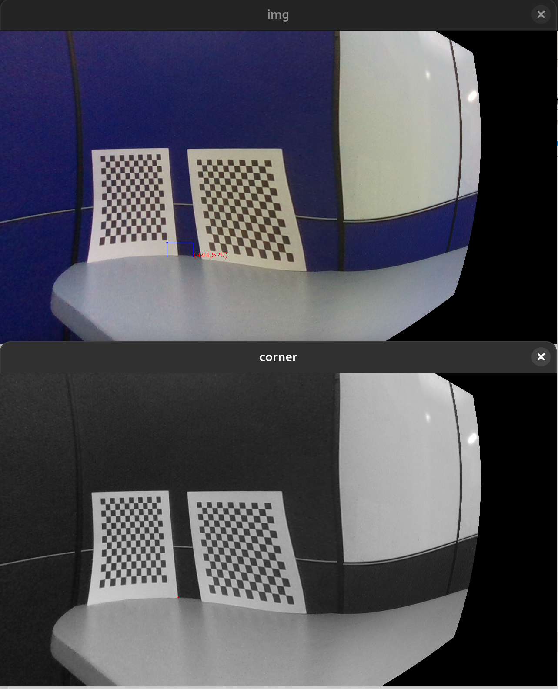
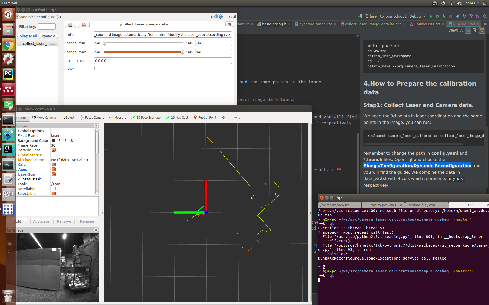
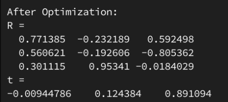

## Camera-Lidar Calibration Tool ROS Version.

Author: xinliangzhong (xinliangzhong@foxmail.com)




This repository can calibrate both lidar and radar with a camera. However, for this test, calibration was only performed between the lidar and the camera. For radar-camera calibration, please refer to the [original repository](https://github.com/TurtleZhong/camera_lidar_calibration_v2)(#).

## Hardware Used:

- **Camera**: Intel RealSense D435i
- **Lidar**: YDLIDAR X4PRO (2D)


# Prerequisites

- Ubuntu 16.04 LTS (tested on this specific version)
- ROS Kinetic
- OpenCV 3
- Ceres Solver

# How to Use

## Step 0:
Place the extracted package into a ROS workspace and compile it using the following command:

```
catkin_make --pkg camera_laser_calibration
```

If you encounter an error related to `cv_bridge`, uncomment line 12 in `CMakeLists.txt`.
If you are prompted that `ceres` is not installed, follow the official instructions to install it.

## Step 1:
Go to your ROS workspace:

```
source devel/setup.bash
```

Then run:

```
roslaunch camera_laser_calibration collect_laser_image_data.launch image_topic:=PATH_TO_YOUR_DATASET
```

Navigate to the directory of the bag file you want to use for calibration and execute:

```
rosbag play --pause XXX.bag
```

Use the spacebar to control the playback and pause of the bag file.

Open a new terminal and start `rqt`.
Select **Plungs/Configuration/Dynamic Reconfiguration**.

Finally, you will see the following two screens in `rviz` and `rqt`, indicating success. In `rviz`, images and laser-colored lines appear, and in `rqt`, the control interface is displayed.



## Step 2

If you prefer not to read the text, you can directly watch the demonstration video `How_to_use.mp4` in the root directory.

**Pause the bag playback.**

Use the **2D Nav Goal** tool in the `rviz` toolbar to select laser/scan points. Once selected, the terminal where the calibration program was initially started will display output similar to the following:

```
[ INFO] [1534164489.163120940]: Setting goal: Frame:laser, Position(**1.575, -0.752**, 0.000), Orientation(0.000, 0.000, -0.688, 0.725) = Angle: -1.518
```

Copy the highlighted portion to the clipboard.
Switch to the `rqt` interface and paste it into the box next to `laser_coor`. For the above example, after pasting, it should display `1.575, -0.752`.

**Check the Save button.**

At this point, the image corresponding to the current laser will pop up. You need to draw a small rectangle. After completing the selection, a feature point corresponding to the coordinate point will be detected and displayed. Then, press the spacebar in the image window. The window will close, and the data will be automatically saved in the `data/data_v2.txt` folder in the format **x y u v**.

## Step 3
Calibration:

Copy the `data/data_v2.txt` file and rename it to `data.txt`.

```
roslaunch camera_laser_calibration calibration.launch image_topic:=PATH_TO_YOUR_DATASET
```

Calibration result:
```
Tcl: The result is the extrinsic parameters from the lidar to the camera, which will be automatically saved in the `data` folder.
```




## Step 4

Now you can see the calibration result in `data/calibration_result.txt`